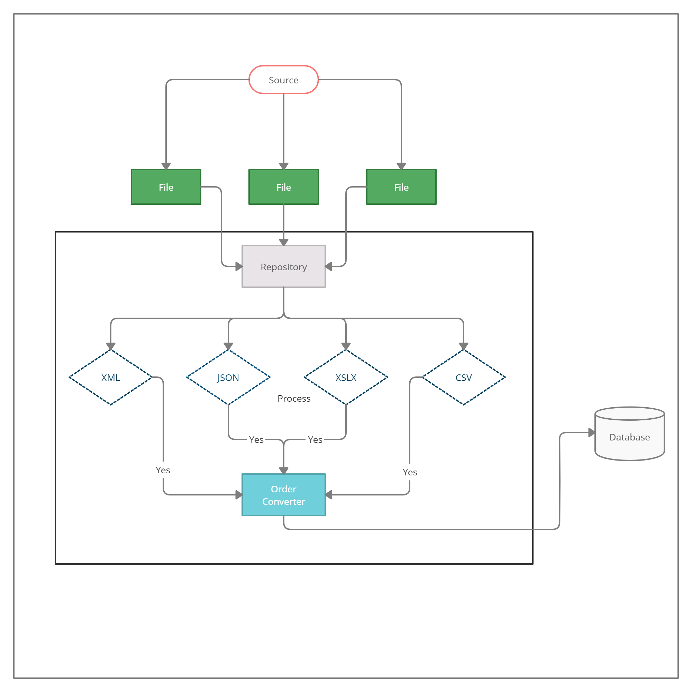

**Модель**

Из разных источников поступают файлы разного формата.
В Репозитории (**Repository.GetOrders**) происходит Инициализация вида файла. Он возвращает конкретный представитель класса, который реализует Интерфейс **IOrderConvert**.
Далее в Конвертере  **FileReaderConverter** происходит конвертация данных и возвращение представителя класса **Order**, который имеет следующие поля:
- LastName
- FirstName
- MiddleName
- Country
- City
- Phone
- Email
- NumberOfOrders
- Date
- Product
- Count

После данные записываются в Базу данных, где имеются 4 Таблицы:
1. Client c полями Id, LastName, FirstName, MiddleName;
2. Contacts: Id, Phone, Email, ClientId=>Client. Id;
3. Location: Country, City, ClientId=>Client. Id;
4. Order: Number, Date, ClientId=>Client. Id, Product, Count;

**Запросом:**
 select c.LastName, c.FirstName, c.MiddleName,
 l.Country, l.City,
 ct.Phone, ct.Email,
 o.Number, o.[Date], o.Product, o.[Count]
 from Client c
 left join [Location] l on c.Id=l.ClientId
 left join Contacts ct on c.Id=ct.ClientId
 left join [Order] o on c.Id=o.ClientId
 **Формируем полную таблицу.**

**Внедрение** зависимостей позволяет уменьшить сильное связывание между Получаемыми файлами.
При получении нового файла, который не является xlsx, xml, csv или json, не придётся переписывать Конвертер, необходимо только добавить новый класс, который будет реализовывать Интерфейс **IOrderConvert.**